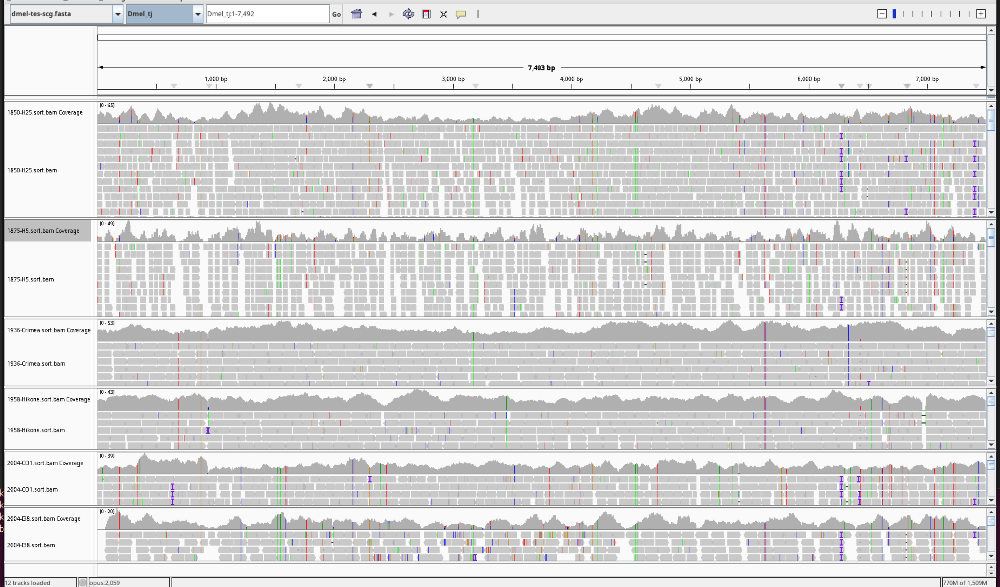
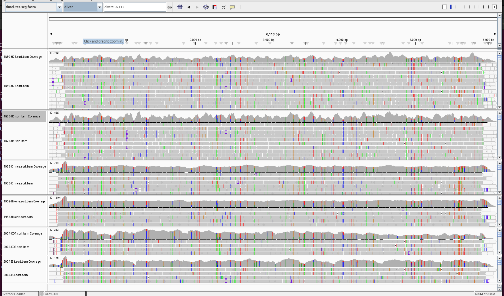
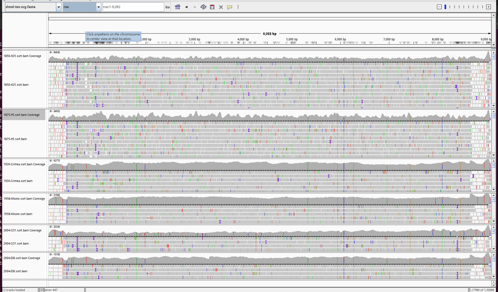
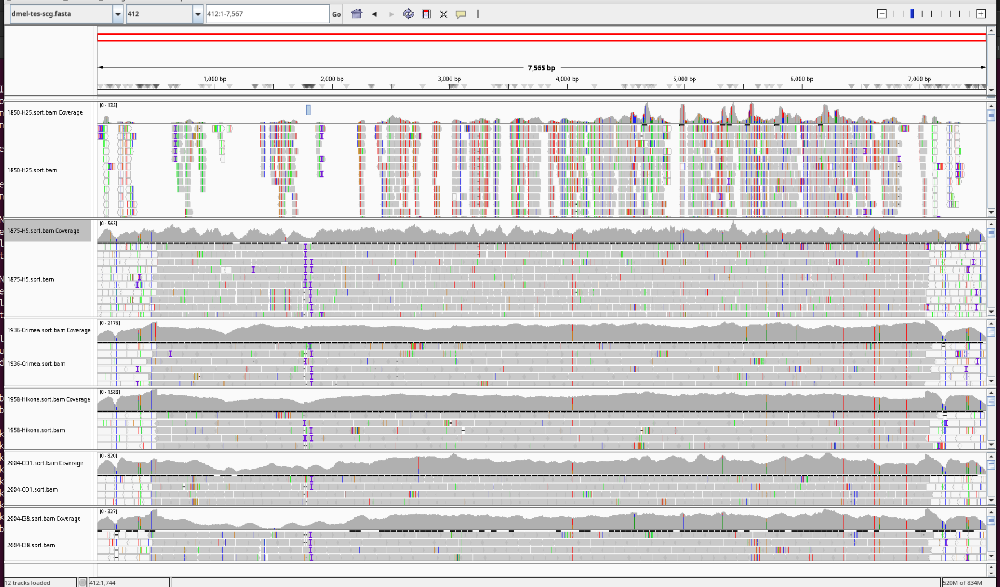
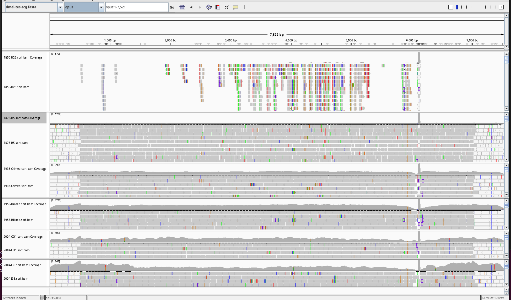
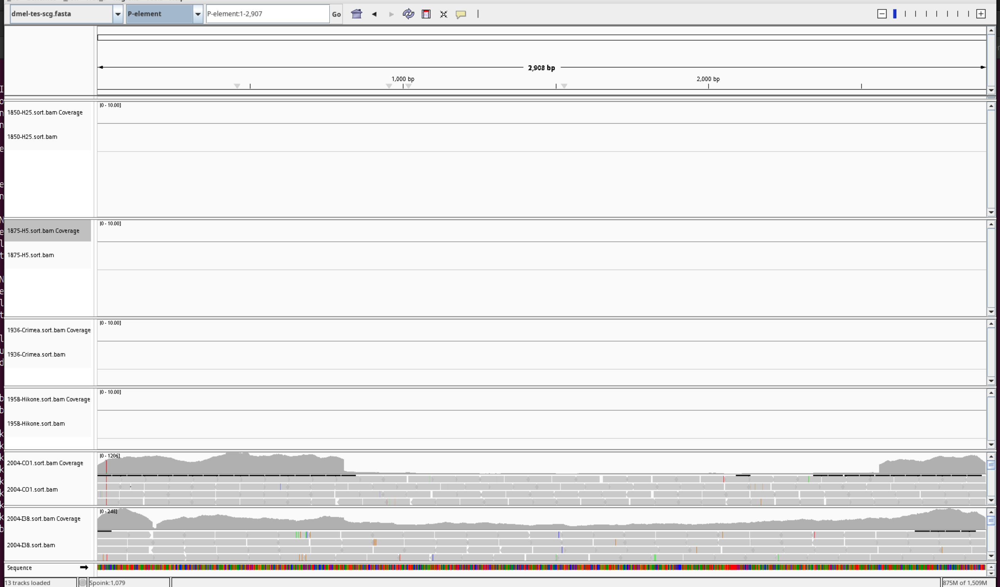
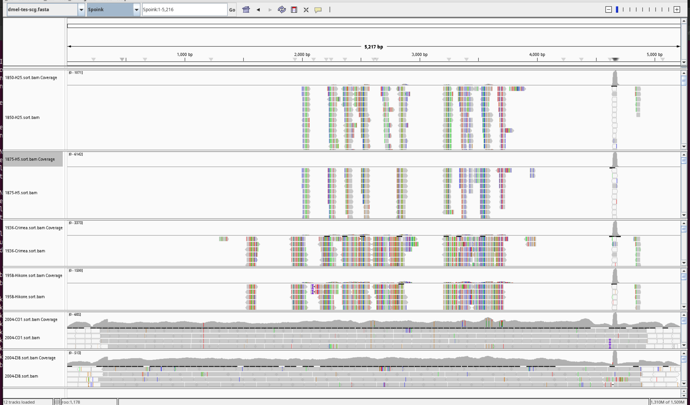
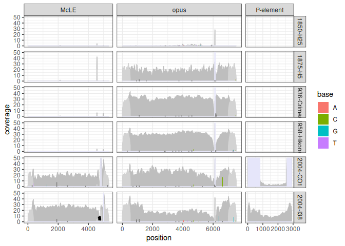
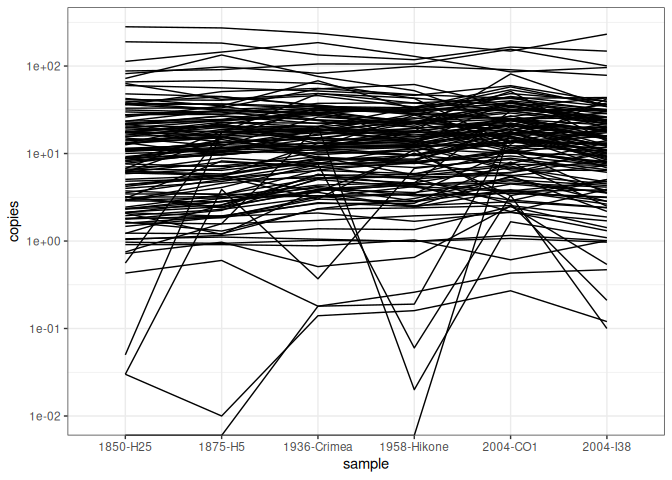
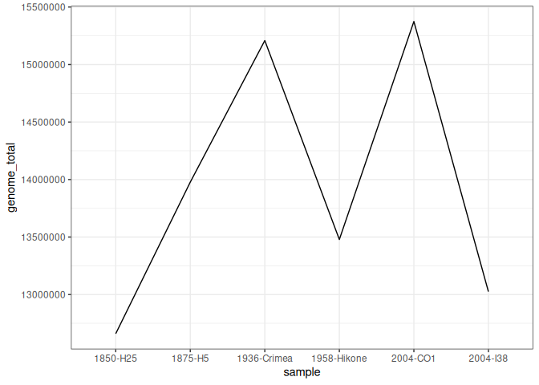

01-compareTEcontentOfSeveralSamples
================
2026-07-13

# Intro

This is a guide showing students on how to best perform bioinformatics
analysis.

1.  Document analysis carefully in RMarkdown (as shown here).
2.  Translate the RMarkdown into a github_document
3.  Upload the RMarkdown and the resulting files to github

**General principles**

- Use conda to manage software installation and make it reproducible.
- Also upload small files that may be helful for analyis.
- In any case always upload the data (can be quite processed) that allow
  to regenerate each figure. Especially figures shown in publications
  (main and supplement) and master thesis.

**Scientific question** The scientific question of this mini-tutorial is
whether we can reproduce the finding that several TEs increased in copy
numbers in recent years
(e.g. <https://www.pnas.org/doi/10.1073/pnas.2313866121>,
<https://academic.oup.com/mbe/article/42/7/msaf143/8157961>)

## Conda

Make a separate Conda environment for each publication, or even for each
analysis

``` bash
# create environment; if feasible aim to pin software versions
conda create -n tutorial -c conda-forge -c bioconda bwa samtools

# enter the new environment
conda  activate tutorial
```

# The Data

The tutorial will be done in a new folder that I called ‘2026-tutorial’.
This analysis will be done in the subfolder 01-compFewStrains (compare a
few strains). However I would recommend the following name
‘2026-07-13-compFewStrains’

Here I introduce another bioinformatics commandment: **thou should have
all data necessary for performing an analysis in the deticated
analysis-folder**

``` bash
# move into the newly generated folder
cd /home/robert-kofler/analysis/2026-tutorial/01-compFewStrains
```

The tutorial needs three data sets:

- short reads of **D. melanogaster** strains sampled at different years
  during the last century.
- a long read assembly; it will be used to validate that the single copy
  genes are really single copy, i.e. occur just once in the reference
  genome
- a TE library plus single copy genes; this is the basis for any
  analysis of TE copy number e.g. with DeviaTE, reveal/seqvista

## the short read data

First we will obtain the short read data. We will use the following
short read data sets. Note the collection date (year) varies from 1850
to 2004; extracted from ‘sup_file_1_short-reads’ from
<https://pubmed.ncbi.nlm.nih.gov/40479505/>

    SRR23876569 H25     PRJNA945389 Shpak2023   1850    Passau, Germany 49  13
    SRR23876565 H5      PRJNA945389 Shpak2023   1875    Zealand, Denmark    55  12
    SRR11846555 Crimea      PRJNA634847 Schwarz2020 1936    Crimea, Ukraine 54  34
    SRR11846565 Hikone-R        PRJNA634847 Schwarz2020 1958    Japan   35  138
    SRR1663560  I38     PRJNA268111 Grenier2015 2004    Ithaca, USA 42  -76
    SRR189041   CO1_1-HE        PRJNA30085  Pool2012    2004    Cameroon    6   10

Download prepare

``` bash
# in /home/robert-kofler/analysis/2026-tutorial/01-compFewStrains 
mkdir rawdata
# folder for the short reads
cd rawdata
```

Download using separate sra environment

``` bash
# for me it was necessary to generate a dedicated sra environment
# otherwise i ended up with an outdated sra-tools version
conda create -n sra -c conda-forge -c bioconda "sra-tools>=3.1"
conda activate sra

# now prefetch
prefetch SRR23876569 SRR23876565 SRR11846555 SRR11846565 SRR1663560 SRR189041
# and dump
fasterq-dump SRR23876569 SRR23876565 SRR11846555 SRR11846565 SRR1663560 SRR189041
```

Rename the files to get a bit more intuitive names using ln. ln
generates hard-links - **it is important to generate hard links** as the
original file name will not be changed nor will the data be duplicated.

``` bash
ln SRR23876569_1.fastq 1850-H25_1.fastq
ln SRR23876569_2.fastq 1850-H25_2.fastq

ln SRR23876565_1.fastq 1875-H5_1.fastq
ln SRR23876565_2.fastq 1875-H5_2.fastq

ln SRR11846555_1.fastq 1936-Crimea_1.fastq
ln SRR11846555_2.fastq 1936-Crimea_2.fastq

ln SRR11846565_1.fastq 1958-Hikone_1.fastq
ln SRR11846565_2.fastq 1958-Hikone_2.fastq

ln SRR1663560_1.fastq 2004-I38_1.fastq
ln SRR1663560_2.fastq 2004-I38_2.fastq

ln SRR189041_1.fastq 2004-CO1_1.fastq
ln SRR189041_2.fastq 2004-CO1_2.fastq

# clean up folder
mkdir original
mv SRR* original

# final test - how folder should look like 
cd ..
ln rawdata
#-rw-rw-r-- 2 robert-kofler 32363766972 Jul 13 16:50 1850-H25_1.fastq
#-rw-rw-r-- 2 robert-kofler 32363766972 Jul 13 16:50 1850-H25_2.fastq
#-rw-rw-r-- 2 robert-kofler 73816095176 Jul 13 16:52 1875-H5_1.fastq
#-rw-rw-r-- 2 robert-kofler 73816095176 Jul 13 16:52 1875-H5_2.fastq
#-rw-rw-r-- 2 robert-kofler 16930082742 Jul 13 16:53 1936-Crimea_1.fastq
#-rw-rw-r-- 2 robert-kofler 16930082742 Jul 13 16:53 1936-Crimea_2.fastq
#-rw-rw-r-- 2 robert-kofler 11910913950 Jul 13 16:53 1958-Hikone_1.fastq
#-rw-rw-r-- 2 robert-kofler 11910913950 Jul 13 16:53 1958-Hikone_2.fastq
#-rw-rw-r-- 2 robert-kofler  9189478234 Jul 13 16:53 2004-CO1_1.fastq
#-rw-rw-r-- 2 robert-kofler  9189478234 Jul 13 16:53 2004-CO1_2.fastq
#-rw-rw-r-- 2 robert-kofler  2994152452 Jul 13 16:53 2004-I38_1.fastq
#-rw-rw-r-- 2 robert-kofler  2994120144 Jul 13 16:53 2004-I38_2.fastq
# drwxrwxr-x 8 robert-kofler        4096 Jul 22 14:30 original/
```

### the T2T reference genome

We use the T2T assembly of **D. melanogaster** published by
<https://www.nature.com/articles/s41467-025-67031-w>

``` bash
# make new folder for reference genome
mkdir refg-wg # reference genome - whole genome

# download the T2t
# available here https://www.ncbi.nlm.nih.gov/datasets/genome/GCA_048772135.1/
# unzip and go to the folder with the fasta file (fna)

# view the fasta names of the different contigs chromosomes
cat GCA_048772135.1_ASM4877213v1_genomic.fna |grep '>'
#>CM113948.1 Drosophila melanogaster strain Canton S chromosome X, whole genome shotgun sequence
#>CM113949.1 Drosophila melanogaster strain Canton S chromosome 2L, whole genome shotgun sequence
#>CM113950.1 Drosophila melanogaster strain Canton S chromosome 2R, whole genome shotgun sequence
#>CM113951.1 Drosophila melanogaster strain Canton S chromosome 3L, whole genome shotgun sequence
#>CM113952.1 Drosophila melanogaster strain Canton S chromosome 3R, whole genome shotgun sequence
#>CM113953.1 Drosophila melanogaster strain Canton S chromosome 4, whole genome shotgun sequence
#>CM113954.1 Drosophila melanogaster strain Canton S chromosome Y, whole genome shotgun sequence
#>JBMFZO010000008.1 Drosophila melanogaster strain Canton S Contig1, whole genome shotgun sequence
#>JBMFZO010000009.1 Drosophila melanogaster strain Canton S Contig2, whole genome shotgun sequence
#>JBMFZO010000010.1 Drosophila melanogaster strain Canton S Contig3, whole genome shotgun sequence
#>JBMFZO010000011.1 Drosophila melanogaster strain Canton S Contig4, whole genome shotgun sequence
#>JBMFZO010000012.1 Drosophila melanogaster strain Canton S Contig5, whole genome shotgun sequence

# conclusion: these are terrible chromosome/contig names and we need to change them
# these names will generate a ton of problems in downstream analysis
```

Change the names of the fasta entries

``` bash
# reformat the fasta names
cat GCA_048772135.1_ASM4877213v1_genomic.fna |perl -pe 's/>.*?Canton S (chromosome )?([^,]+).*/>$2/' > ../../../../refg-wg/Dmel-canton-t2t.raw.fasta
# this perl command is prety cool and reformats the fasta entry names; 
# dont worry about details of this code although I'm quite proud i came up with this code WITHOUT claude ;)

cat Dmel-canton-t2t.raw.fasta |grep '>'
#>X
#>2L
#>2R
#>3L
#>3R
#>4
#>Y
#>Contig1
#>Contig2
#>Contig3
#>Contig4
#>Contig5

# conclusion: name conversion worked; these are pretty names - minimal and no weird characters - that will likely not generate problems downstream
```

Finally convert to upper case; I do not trust the mix of lower-case with
upper-case sequences. Admittedly I may be paranoid, but there is
certainly software that has problems when some sequences are lowercase
and others are uppercase. However, this softmasking (repeats are
lowercase) seems to be important for AUGUSTUS and BRAKER, and perhaps
speeds up blastn

``` bash

# use seqtk
conda install -c conda-forge -c bioconda seqtk seqkit
seqtk seq -U -l 80 Dmel-canton-t2t.raw.fasta > ../Dmel-canton.fasta

# finally index for mapping
bwa index Dmel-canton.fasta
```

## the reference for estimating TE copy numbers

For estimating TE copy numbers we need a reference consisting of TE
sequences and single copy genes.

### single copy genes

We start with the single copy genes; thee scg are uploaded with this
tutorial; this illustrates one important principle: upload small data
files that may be helpful for the analysis.

``` bash
# first put the scg into a separte folder
mkdir refg

# now lets insepect the sequences
# lets use seqkit which is amazingly powerful; you may choose what to display
# lets pick the name (-n) the length (-l) and the gc-content (-g)
seqkit fx2tab -nlg scg_rhi_tj_rpl32.fa
# Dmel_rhi  9026    41.18
# Dmel_rpl32    4933    50.86
# Dmel_tj   7492    45.65
```

Next lets make sure these are actually single copy genes. Lets map them
to the T2T assembly

``` bash
# align with minimap2
conda install -c conda-forge -c bioconda minimap2 
# parameters asm5 specify alignment in same species; or close strain
minimap2 -x asm5 ../refg-wg/Dmel-canton.fasta scg_rhi_tj_rpl32.fa > scg_rhi_tj_rpl32.paf 
cat scg_rhi_tj_rpl32.paf
#Dmel_rhi   9026    56  9012    +   2R  25256157    17472349    17481017    7550    8983    60  tp:A:P  cm:i:720    s1:i:7488   s2:i:0  dv:f:0.0004 rl:i:0
#Dmel_rpl32 4933    11  4920    +   3R  34507726    32434168    32439077    4909    4909    60  tp:A:P  cm:i:491    s1:i:4909   s2:i:0  dv:f:0.0001 rl:i:0
#Dmel_tj    7492    1   7475    +   2L  24366070    19617917    19625428    6875    7517    60  tp:A:P  cm:i:675    s1:i:6863   s2:i:0  dv:f:0.0003 rl:i:0

# conclusion: every gene has just one entry; extending over the entire sequence; so they are clearly single-copy genes
```

### TE sequences

lets download the TE sequences of Dmel and inspect them.

``` bash
seqkit fx2tab -nlg dmel-tes.fasta
#Tc3    1743    33.33
#1731   4648    46.21
# ...
# ...
#P-element  2907    36.91
#gypsy1 7718    47.65
#Spoink 5216    39.76
#McLE   5360    40.90
#Souslik    5275    45.00
#Transib1   3030    32.28
#Kuruka 8833    40.09
# => nice many TEs including Kuruka, Spoink, Transib1, Souslik, MLE (McLE)

# lets see how many we have
seqkit fx2tab -nlg dmel-tes.fasta |wc
#    132     396    2366
# we have 132 TE consensus seuqences
```

## merge

lets merge the TE sequence and the scg and lets prepare them for mapping

``` bash
cat dmel-tes.fasta scg_rhi_tj_rpl32.fa > ../dmel-tes-scg.fasta
# lets double check the number of sequences
seqkit fx2tab -nlg ../dmel-tes-scg.fasta|wc
    135     405    2428
# perfect 132(TEs) + 3(scg) = 135

# now prepare for mapping
bwa index dmel-tes-scg.fasta
```

# Main analysis

## simple mapping single end

Lets start with the simples strategy: we only use one read of the
paired-end and map the short read data to the TE-reference with bwa mem,
which performs a local alignment so that adaptors should be removed
during alignments. **ALWAYS start with the simple approach first**
Gradually add complexity where needed

single end mappging

``` bash
mkdir map-se
# mapping will be done with the following shell script
# begin map.sh
ref="/home/robert-kofler/analysis/2026-tutorial/01-compFewStrains/refg/dmel-tes-scg.fasta"
in="/home/robert-kofler/analysis/2026-tutorial/01-compFewStrains/rawdata"
out="/home/robert-kofler/analysis/2026-tutorial/01-compFewStrains/map-se"

bwa mem -t 8 $ref $in/1850-H25_1.fastq | samtools sort -@ 4 -o $out/1850-H25.sort.bam -
bwa mem -t 8 $ref $in/1875-H5_1.fastq | samtools sort -@ 4 -o $out/1875-H5.sort.bam -
bwa mem -t 8 $ref $in/1936-Crimea_1.fastq | samtools sort -@ 4 -o $out/1936-Crimea.sort.bam -
bwa mem -t 8 $ref $in/1958-Hikone_1.fastq | samtools sort -@ 4 -o $out/1958-Hikone.sort.bam -
bwa mem -t 8 $ref $in/2004-CO1_1.fastq | samtools sort -@ 4 -o $out/2004-CO1.sort.bam -
bwa mem -t 8 $ref $in/2004-I38_1.fastq | samtools sort -@ 4 -o $out/2004-I38.sort.bam -
# End shell script

# start mapping
zsh map.sh

# index them all for later IGV
for i in *.bam; do samtools index $i; done
```

## intuitive epxloration

So lets inspect the data in IGV; use the refg as reference \### scg The
single copy gene should have a uniform coverage in all samples; As an
example lets use tj (traffic jam); this is indeed the case

**tj**

 \### no invaders lets move to TEs
that did not invade. Diver and roo

**Diver**

 **roo**

<figure>

<figcaption aria-hidden="true">roo</figcaption>
</figure>

### early invaders in 19th century

lets move to TEs that invaded in the 19th century; Opus and 412

**412**  **Opus**


### late invaders in 20th century

lets move to TEs that invaded in the 19th century; P-element and Spoink

**P-element** 
**Spoink**

<figure>

<figcaption aria-hidden="true">Spoink</figcaption>
</figure>

### Conclusion

Already our xxplorative analysis in IGV confirms the recent invasions.
The scg tj, Diver and roo show no differnce in the samples, Opus and 412
invaded in the 19th century and P-element and Spoink in the 20th
century. However this was a very crude analysis. Most importantly we did
not normalize the read numbers yet, we need to normalize to the coverage
of single copy genes. We use TEplotter (deviate-derivate)

## Normalizing to coverage with scg - teplotter

``` bash
# install
git clone git@github.com:RobertKofler/teplotter.git
git checkout -b robert
# add teplotter to path
# and install dependency
conda install -c conda-forge -c bioconda pysam  
```

**convert bam into so (sequence overview)**

``` bash
bam2so.py --infile map-se/1958-Hikone.sort.bam --fasta refg/dmel-tes-scg.fasta --output-file sose2/tmp/1958-Hikone.so &
bam2so.py --infile map-se/1958-Crimea.sort.bam --fasta refg/dmel-tes-scg.fasta --output-file sose2/tmp/1936-Crimea.so &
bam2so.py --infile map-se/1936-Crimea.sort.bam --fasta refg/dmel-tes-scg.fasta --output-file sose2/tmp/1936-Crimea.so &
bam2so.py --infile map-se/1850-H25.sort.bam --fasta refg/dmel-tes-scg.fasta --output-file sose2/tmp/1850-H25.so &
bam2so.py --infile map-se/1875-H5.sort.bam --fasta refg/dmel-tes-scg.fasta --output-file sose2/tmp/1875-H5.so &
bam2so.py --infile map-se/2004-CO1.sort.bam --fasta refg/dmel-tes-scg.fasta --output-file sose2/tmp/2004-CO1.so &
```

**normalize**

``` bash
normalize-so.py --so tmp/1850-H25.so --scg-begin 'Dmel' --output-file 1850-H25.norm.so
normalize-so.py --so tmp/1875-H5.so --scg-begin 'Dmel' --output-file 1875-H5.norm.so
normalize-so.py --so tmp/1936-Crimea.so --scg-begin 'Dmel' --output-file 1936-Crimea.norm.so
normalize-so.py --so tmp/1936-Hikone.so --scg-begin 'Dmel' --output-file 1958-Hikone.norm.so
normalize-so.py --so tmp/1958-Hikone.so --scg-begin 'Dmel' --output-file 1958-Hikone.norm.so
normalize-so.py --so tmp/2004-CO1.so --scg-begin 'Dmel' --output-file 2004-CO1.norm.so
normalize-so.py --so tmp/2004-I38.so --scg-begin 'Dmel' --output-file 2004-I38.norm.so
```

**lets plot some**

``` bash
# shell script
so2plotable.py --so 1850-H25.norm.so --seq-ids opus,P-element,McLE --sample-id 1850-H25  --mask-ymax 50  > toplo/1850-H25.plotable
so2plotable.py --so 1875-H5.norm.so --seq-ids opus,P-element,McLE --sample-id 1875-H5  --mask-ymax 50 > toplo/1875-H5.plotable
so2plotable.py --so 1936-Crimea.norm.so --seq-ids opus,P-element,McLE --sample-id 1936-Crimea --mask-ymax 50 > toplo/1936-Crimea.plotable
so2plotable.py --so 1958-Hikone.norm.so --seq-ids opus,P-element,McLE --sample-id 1958-Hikone --mask-ymax 50 > toplo/1958-Hikone.plotable
so2plotable.py --so 2004-CO1.norm.so --seq-ids opus,P-element,McLE --sample-id 2004-CO1 --mask-ymax 50 > toplo/2004-CO1.plotable
so2plotable.py --so 2004-I38.norm.so --seq-ids opus,P-element,McLE --sample-id 2004-I38 --mask-ymax 50 > toplo/2004-I38.plotable
cat toplo/*plotable > toplo/toplot
```

**lets plot** Ideally one should upload the toplot file, as it is the
input for the grafik; unfortunatelly its \>2Mb thats why I do not do it.
But this nicely illustrates how important it is to upload the input
files, because this figure is now irreproducible; at least it requires a
major effort and redo all analsysis. Note that RMarkdown integrates the
figure automatically into the md (i did not have to do anything)

``` r
# Rscript visualize-plotable.R input.plotable output.png
library(tidyverse)  
```

    ## ── Attaching core tidyverse packages ──────────────────────── tidyverse 2.0.0 ──
    ## ✔ dplyr     1.2.1     ✔ readr     2.2.0
    ## ✔ forcats   1.0.1     ✔ stringr   1.6.0
    ## ✔ ggplot2   4.0.3     ✔ tibble    3.3.1
    ## ✔ lubridate 1.9.5     ✔ tidyr     1.3.2
    ## ✔ purrr     1.2.2     
    ## ── Conflicts ────────────────────────────────────────── tidyverse_conflicts() ──
    ## ✖ dplyr::filter() masks stats::filter()
    ## ✖ dplyr::lag()    masks stats::lag()
    ## ℹ Use the conflicted package (<http://conflicted.r-lib.org/>) to force all conflicts to become errors

``` r
file<-"/home/robert-kofler/analysis/2026-tutorial/01-compFewStrains/sose2/toplo/toplot"

mindeletion=10 # minimum length of the internal deletions
width=8       # plot width 
height=5      # plot height
dpi=300       # plot dpi

data <- read_tsv(file,col_names = FALSE,cols(.default = col_character()))

# split of coverage
cov <- data |> filter(X3== "cov")
cov <- cov |> rename(seqid=X1,sampleid=X2,feature=X3,pos=X4,covy=X5) 
cov <- cov |> mutate(pos = as.double(pos),covy= as.double(covy))

# split of ambcoverge
ambcov <- data |> filter(X3== "ambcov")
ambcov <- ambcov |> rename(seqid=X1,sampleid=X2,feature=X3,pos=X4,ambcovy=X5) 
ambcov <- ambcov |> mutate(pos = as.double(pos),ambcovy= as.double(ambcovy))

# split of mcov
mcov <- data |> filter(X3== "mcov")
mcov <- mcov |> rename(seqid=X1,sampleid=X2,feature=X3,pos=X4,mcovy=X5) 
mcov <- mcov |> mutate(pos = as.double(pos),mcovy= as.double(mcovy))

# split of snps
snp <- data |> filter(X3=="snp")
snp <- snp |> rename(seqid=X1,sampleid=X2,feature=X3,pos=X4,refc=X5,base=X6,count=X7) 
snp <- snp |>  mutate(pos = as.double(pos),count= as.double(count))


# split of deletion
deletion <- data |> filter(X3== "del")
deletion <- deletion |> rename(seqid=X1,sampleid=X2,feature=X3,start=X4,end=X5,startcov=X6,endcov=X7,count=X8) 
deletion <- deletion |> mutate(start = as.double(start),end= as.double(end),startcov = as.double(startcov),endcov= as.double(endcov),count= as.double(count))

# split of insertion
insertion <- data |> filter(X3=="ins")
insertion <- insertion |> rename(seqid=X1,sampleid=X2,feature=X3,pos=X4,length=X5,count=X6) 
insertion <- insertion |> mutate(pos = as.double(pos), length= as.double(length), count= as.double(count))

# prepare insertions
# filter min size of insertion
deletion<- deletion |> filter(end-start>mindeletion)
# size of scaling
deletion$scale=log(deletion$count)

theme_set(theme_bw())
plo<-ggplot()+
  geom_polygon(data = cov, mapping = aes(x = pos, y = covy), fill = 'grey', color = 'grey') +
  geom_polygon(data = ambcov, aes(x = pos, y = ambcovy), fill = 'lightgrey', color = 'lightgrey')+
  geom_polygon(data = mcov, aes(x = pos, y = mcovy), fill = 'lavender', color = 'lavender')+
  geom_curve(data = deletion, mapping = aes(x = start, y = startcov, xend = end, yend = endcov, linewidth = scale),  curvature = -0.15, ncp=5,show.legend = FALSE)+
  scale_linewidth(range = c(0.3, 2))+xlab("position") + ylab("coverage")+
  geom_bar(data=snp,aes(x=pos,y=count,fill=base),stat="identity",width=2)+
  geom_bar(data=insertion,aes(x=pos,y=count),stat="identity",color="grey50",width=4)


# faceting
nseq<-n_distinct(cov$seqid)
nsample<-n_distinct(cov$sampleid)
if (nseq > 1 & nsample>1) {
  plo<-plo+facet_grid(sampleid~seqid,scales = "free_x", space = "free_x")
} else if (nseq>1){
  plo<-plo+facet_grid(~seqid,scales = "free_x", space = "free_x")
}else if (nsample>1){
  plo<-plo+facet_grid(sampleid~.)
}

plot(plo)
```

    ## Warning: `position_stack()` requires non-overlapping x intervals.
    ## `position_stack()` requires non-overlapping x intervals.
    ## `position_stack()` requires non-overlapping x intervals.
    ## `position_stack()` requires non-overlapping x intervals.
    ## `position_stack()` requires non-overlapping x intervals.
    ## `position_stack()` requires non-overlapping x intervals.
    ## `position_stack()` requires non-overlapping x intervals.
    ## `position_stack()` requires non-overlapping x intervals.

<!-- -->
This figure nicely demonstrates some invasions during the last century

### estimate the copy numbers of all TEs

one hypothesis is that TE copy numbers decrease over time; so this loss
compensates for the gain by recent invasions. Lets try if we see this
with our samples.

**estimate copy number of all TEs**

``` bash
estimate-so.py --so 1850-H25.norm.so --sample-id 1850-H25 > estimate/1850-H25.estimate
estimate-so.py --so 1875-H5.norm.so --sample-id 1875-H5 > estimate/1875-H5.estimate
estimate-so.py --so 1958-Hikone.norm.so --sample-id 1958-Hikone > estimate/1958-Hikone.estimate
estimate-so.py --so 1936-Crimea.norm.so --sample-id 1936-Crimea > estimate/1936-Crimea.estimate
estimate-so.py --so 2004-CO1.norm.so --sample-id 2004-CO1 > estimate/2004-CO1.estimate
estimate-so.py --so 2004-I38.norm.so --sample-id 2004-I38 > estimate/2004-I38.estimate

# merge and only retain important information (first 4 columns)
cat estimate/*estimate > estimate/myestimate
cat myestimate |cut -f1-4 > bareminimum
```

**NOTE** this file will be provided so its easy to redo this analysis

``` r
# Rscript visualize-plotable.R input.plotable output.png
library(tidyverse)  
file<-"/home/robert-kofler/analysis/2026-tutorial/01-compFewStrains/sose2/estimate/bareminimum"
data <- read_tsv(file,col_names = FALSE,cols(.default = col_character()))
names(data)<-c("sample","TE","len","copies")
data$copies<-as.numeric(data$copies)


theme_set(theme_bw())
gp<-ggplot(data, aes(x = sample, y = copies, group = TE))+
  geom_line()+scale_y_log10()
plot(gp)
```

    ## Warning in scale_y_log10(): log-10 transformation introduced infinite values.

<!-- --> I
am not sure do we see that the copy numbers of TEs change over time? Are
they getting less? I do not think so actually. Lets see how the total
number of TEs changes over time (size of TE times its copy number;
summed for all TEs)

``` r
# Rscript visualize-plotable.R input.plotable output.png
library(tidyverse)  
file<-"/home/robert-kofler/analysis/2026-tutorial/01-compFewStrains/sose2/estimate/bareminimum"
data <- read_tsv(file,col_names = FALSE,cols(.default = col_character()))
names(data)<-c("sample","TE","len","copies")
data$copies<-as.numeric(data$copies)
data$len<-as.numeric(data$len)

# next lets see how the total size of the TEs develops over time
data$genome <- data$copies*data$len
result <- data %>% group_by(sample) %>% summarise(genome_total = sum(genome))
gp<-ggplot(result, aes(x = sample, y = genome_total,group=1))+geom_line()
plot(gp)
```

<!-- -->
No clear trend; i gues we need more samples. Thats it my friends.

# Finally lets provide the yaml

The yaml specifies all software that were used; Ideally the version
should be provided to make it reproducible (tuorial-full.yaml).

``` bash
conda env export -n tutorial > tutorial-full.yaml
conda env export -n tutorial --from-history > tutorial-environment.yaml
# both files are attached

# the last one is shorter and looks like this
name: tutorial
channels:
  - bioconda
  - conda-forge
dependencies:
  - bwa=0.7.19
  - samtools=1.24
  - aria2
  - sra-tools
  - pigz
  - seqtk
  - seqkit
  - minimap2
  - adapterremoval
  - pysam
  - r-tidyverse
prefix: /home/robert-kofler/miniforge3/envs/tutorial
```

# Future improvements

This was a very simple analysis just using a single read of a pair; no
adaptor trimming; no merging of overlapping reads; But it clearly
revealed a trend. Will a more complex analysis make it more reliable?
Perhaps but I guess not necessarily so.

In any case a more complex analysis will involve the following: 1)
utilize paired ends and 2) remove adaptors. This can (and should) be
done with a single step, eg. using AdaptorRemoval

``` bash
conda install -c conda-forge -c bioconda adapterremoval 
AdapterRemoval --file1 1850-H25_1.fastq --file2 1850-H25_2.fastq --collapse --minlength 25 --minadapteroverlap 1 --gzip --threads 8 

# i will just use the collapsed output (the non-collapsed are not manyy)
mv your_output.collapsed.gz 1850-H25.collapsed.gz 
#since reads are trimmed we can use the recommended semi-global alignment bwa aln
# bwa aln recommended for ancient DNA
bwa aln -l 1024 -n 0.01 -o 2 -t 8 refg/dmel-tes-scg.fasta rawdata/1850-H25.collapsed.gz > map-se/1850-H25.collapsed.sai
```
